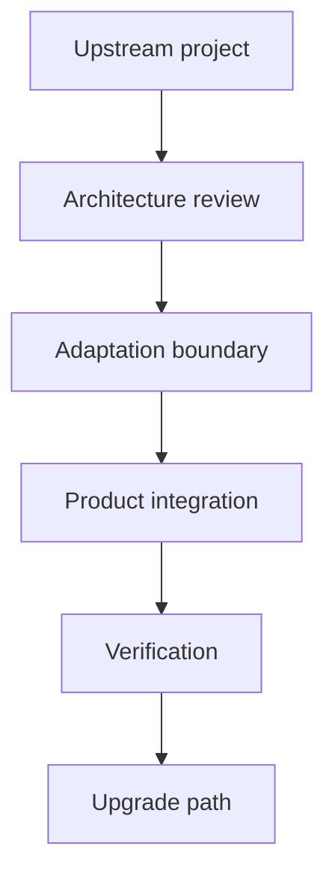

  

# Technology adaptation and orchestration

Building well does not always mean starting from zero. It often means understanding an existing system quickly, deciding what to keep, changing what matters, and preserving a safe path for licences, upgrades, and security fixes.

[Discuss a similar system](mailto:ju@jomena.group?subject=Discuss%20Technology%20adaptation%20and%20orchestration) | [Book a technical call](mailto:ju@jomena.group?subject=Book%20a%20technical%20call%20about%20Technology%20adaptation%20and%20orchestration)

## The engineering problem

Upstream projects arrive with their own domain assumptions and release cadence. Adapting them responsibly requires architectural judgment and clear separation between upstream work and local product decisions.

## What the system covers

- Architecture and dependency evaluation
- Design-system and application adaptation
- Authentication and account integration
- Upgrade and patch strategy
- Licence and attribution management
- Product-specific orchestration

## System shape

## Build notes

- Preserve upstream identity and licence history.
- Avoid edits that make future security updates impossible.
- Own the adaptation and orchestration without claiming the upstream invention.

This page covers architecture, adaptation, and orchestration. Upstream projects remain credited to their maintainers and licences. Work produced under the Aryze umbrella remains private and owned by Aryze.

## Talk through a similar problem

If you are trying to build, untangle, or ship a system in this area, [send me a note](mailto:ju@jomena.group?subject=I%20need%20help%20with%20Technology%20adaptation%20and%20orchestration). If the problem needs a deeper technical conversation, [book a call by email](mailto:ju@jomena.group?subject=Book%20a%20technical%20call%20about%20Technology%20adaptation%20and%20orchestration).
