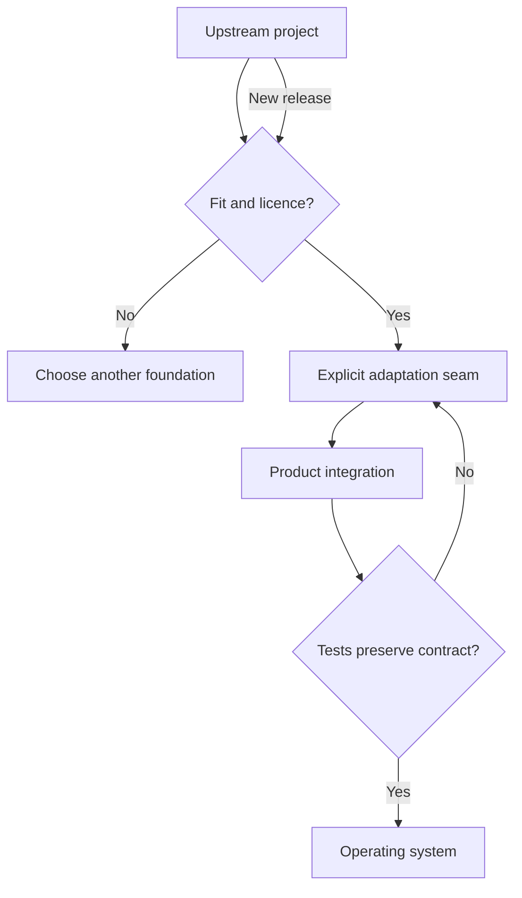

[← All work](https://github.com/J0UH) · [Product engineering](https://github.com/J0UH/product-engineering)

# Technology adaptation and orchestration

Understanding existing technology well enough to adapt it thoughtfully and keep it maintainable.

An existing system can save a great deal of work. It also arrives with a domain model, dependencies, a licence, and a view of how it should be operated.

I enjoy finding the useful fit between that foundation and the product at hand. The work is in understanding what to keep, where a change belongs, and how the result can continue taking fixes from upstream.

## Owning the adaptation

The evaluated foundations include interface systems, authentication tools, dashboard kits, and other product stacks. Their original authorship remains visible.

My focus is the local product decision: how the interfaces fit, which assumptions need changing, and where to keep a seam between the foundation and the adaptation.

Upgrade and patch strategy influence those choices early. A shortcut that makes future security updates impractical can become more expensive than the work it saved. Good reuse gives a product a stronger starting point while preserving the identity and maintenance path of the technology underneath it.

## Built on

The evaluated foundations include Base Web, Better Auth, BundUI's dashboard kit, `udm-le`, and other public or commercially licensed product stacks. The point of the work is not to claim those systems, but to understand their interfaces, licences, upgrade paths, and seams well enough to adapt them without erasing where they came from.

## What the work covers

- Architecture and dependency evaluation
- Design-system and application adaptation
- Authentication and account integration
- Upgrade and patch strategy
- Licence and attribution management
- Product-specific orchestration

A closer look at the technical flow

## Related work

- [Product engineering](https://github.com/J0UH/product-engineering)
- [CEX and DAX platform adaptation](https://github.com/J0UH/cex-platform-adaptation)
- [CRM and relationship operations](https://github.com/J0UH/crm-operations)

Working on a similar problem? [Tell me what you are building](mailto:ju@jomena.group?subject=Technology%20adaptation%20and%20orchestration).

*This is a public account of the work. Source code and private operating details are not included in this repository.*
