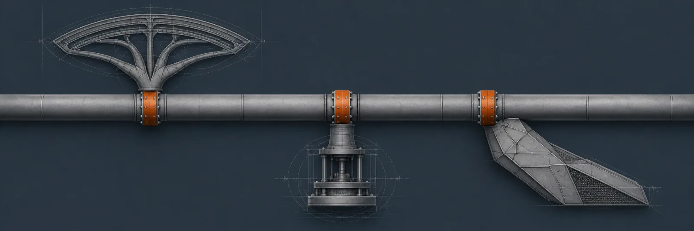
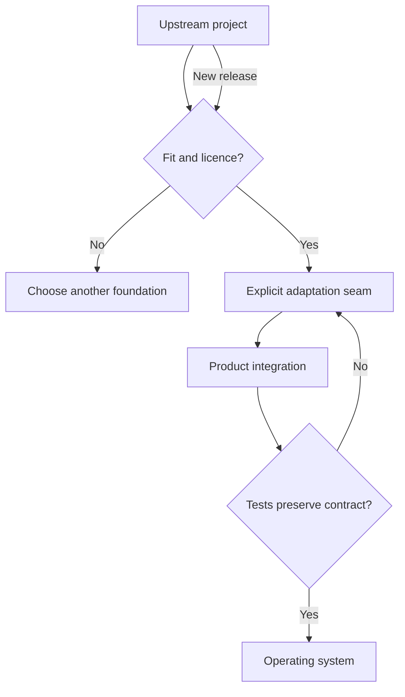

[← All systems](https://github.com/J0UH) · [Product engineering](https://github.com/J0UH/product-engineering)

  

# Technology adaptation and orchestration

Building well does not always mean starting from zero. It often means understanding an existing system quickly, deciding what to keep, changing what matters, and preserving a safe path for licences, upgrades, and security fixes.

## The engineering problem

Upstream projects arrive with their own domain assumptions and release cadence. Adapting them responsibly requires architectural judgment and clear separation between upstream work and local product decisions.

## Foundation and adaptation

The evaluated foundations include Base Web, Better Auth, BundUI's dashboard kit, `udm-le`, and other public or commercially licensed product stacks. The point of the work is not to claim those systems, but to understand their interfaces, licences, upgrade paths, and seams well enough to adapt them without erasing where they came from.

## What the system covers

- Architecture and dependency evaluation
- Design-system and application adaptation
- Authentication and account integration
- Upgrade and patch strategy
- Licence and attribution management
- Product-specific orchestration

## System shape

## Build notes

- Preserve upstream identity and licence history.
- Avoid edits that make future security updates impossible.
- Own the adaptation and orchestration without claiming the upstream invention.

Public overview only. Source code, customer data, credentials, and private operating details are not included.

## Talk through a similar problem

Working on something similar? [Tell me about it](mailto:ju@jomena.group?subject=Technology%20adaptation%20and%20orchestration).
